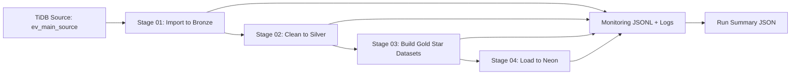

# EV Star Schema ETL Pipeline


## Overview
A production-style ETL project that transforms one operational EV source table (`ev_main_source`) into an analytics-ready star schema in Neon PostgreSQL.

This project demonstrates:
- Enterprise ETL layering (Bronze, Silver, Gold)
- Star schema modeling from a single source table
- Automated end-to-end orchestration
- Data quality checks and monitoring artifacts
- Full refresh load into Neon PostgreSQL

## Business Value
EV operational data usually mixes sales, charging, production, service, customer, vehicle, and location fields in one wide table.

This pipeline converts that wide source into a clean analytics model with:
- One fact table (`fact_ev_activity`)
- Multiple dimension tables (`dim_*`)

This output is ready for:
- BI dashboards
- KPI tracking by activity type, manufacturer, region, and time
- Downstream analytics and reporting workloads

## Architecture


## ETL Workflow
| Stage | Script | Purpose | Key Output |
|---|---|---|---|
| 01 | `01_import_to_bronze.py` | Extract source table from TiDB into Parquet | `bronze/ev_main_source.parquet` |
| 02 | `02_silver.py` | Clean text values, normalize empty strings | `silver/ev_main_source.parquet` |
| 03 | `03_gold.py` | Build dimensions and fact datasets | `gold/dim_*.parquet`, `gold/fact_ev_activity.parquet` |
| 04 | `04_load_neon.py` | Validate target tables, truncate, reload data | `public.dim_*`, `public.fact_ev_activity` in Neon |
| Orchestrator | `run_pipeline.py` | Run stages in order (full/partial) | Consolidated run summary |

## Star Schema Strategy
Source table:
- `ev_main_source`

Target tables:
- Fact: `fact_ev_activity`
- Dimensions: `dim_date`, `dim_activity`, `dim_manufacturer`, `dim_vehicle`, `dim_battery`, `dim_customer`, `dim_location`, `dim_station`

Modeling notes:
- Fact grain: one row per source `record_id`
- `source_record_id` is kept in fact to preserve source lineage
- Dimensions are built from distinct natural keys and linked through surrogate keys

## Enterprise Features Implemented
### Reliability
- Retry support for transient DB operations
- Strict mode quality gates
- Safe stage failure tracking with run id

### Data Quality
- Source table load check
- Bronze-to-Silver row count check
- Fact row parity check (source rows = fact rows)
- Required foreign key null checks
- `source_record_id` duplicate check
- Post-load row count validation per target table

### Monitoring
Per run id, the pipeline generates:
- `{run_id}_stage_metrics.jsonl`
- `{run_id}_data_quality_checks.jsonl`
- `{run_id}_run_summary.json`

Location:
- [EV_Star_ETL_Pipeline/logs](EV_Star_ETL_Pipeline/logs)

## Execution Proof (Validated Run)
Reference run summary:
- [EV_Star_ETL_Pipeline/logs/evs_20261005T084850Z_1829678a_run_summary.json](EV_Star_ETL_Pipeline/logs/evs_20261005T084850Z_1829678a_run_summary.json)

Key results:
| Metric | Value |
|---|---|
| Run Status | success |
| Total Stages | 4 |
| Checks Passed | 15 |
| Checks Failed | 0 |
| Source Rows Extracted | 10000 |
| Fact Rows Loaded | 10000 |

## Project Structure
```text
EV_ETL_Project/
|- README.md
|- requirements.txt
|- .env
|- myenv/
|- Sample_Geography_ETL_Pipeline/
|- EV_Star_ETL_Pipeline/
|  |- README.md
|  |- logs/
|  |- parquet/
|  |  |- bronze/
|  |  |- silver/
|  |  |- gold/
|  |- scripts/
|     |- ev_common.py
|     |- 01_import_to_bronze.py
|     |- 02_silver.py
|     |- 03_gold.py
|     |- 04_load_neon.py
|     |- run_pipeline.py
```

## Quick Start
### 1) Install dependencies
```powershell
pip install -r .\requirements.txt
```

### 2) Run full ETL
```powershell
.\myenv\Scripts\python.exe .\EV_Star_ETL_Pipeline\scripts\run_pipeline.py
```

### 3) Run partial ETL (example: silver to load)
```powershell
.\myenv\Scripts\python.exe .\EV_Star_ETL_Pipeline\scripts\run_pipeline.py --from-stage 02 --to-stage 04
```

## Environment Configuration
Credentials are read from root `.env`:
- TiDB source: `TIDB_HOST`, `TIDB_PORT`, `TIDB_USERNAME` (or `TIDB_USER`), `TIDB_PASSWORD`, `TIDB_DATABASE`
- Neon target: `NEON_DSN` (or `NEON_HOST`/`NEON_DB`/`NEON_USER`/`NEON_PASSWORD`), `TARGET_SCHEMA`

Optional pipeline keys (with defaults):
- `EVSF_SOURCE_TABLE` (default: `ev_main_source`)
- `EVSF_BRONZE_LAYER_SUBDIR` (default: `bronze`)
- `EVSF_SILVER_LAYER_SUBDIR` (default: `silver`)
- `EVSF_GOLD_LAYER_SUBDIR` (default: `gold`)
- `EVSF_LOG_SUBDIR` (default: `logs`)
- `EVSF_BATCH_SIZE` (default: `BATCH_SIZE` or `50000`)
- `EVSF_STRICT_MODE` (default: `true`)
- `EVSF_MAX_DB_RETRIES` (default: `3`)
- `EVSF_RETRY_BACKOFF_SECONDS` (default: `2`)

## Tech Stack
- Python 3.13
- Pandas
- SQLAlchemy
- PyMySQL (source)
- psycopg2 (target)
- Parquet + PyArrow
- Neon PostgreSQL

## Portfolio Highlights
- Designed and implemented a layered ETL system with production-style controls
- Converted a wide operational EV source into an analytics-friendly star schema
- Added robust logging, monitoring, and quality validations
- Validated end-to-end run with successful cloud load into Neon PostgreSQL
